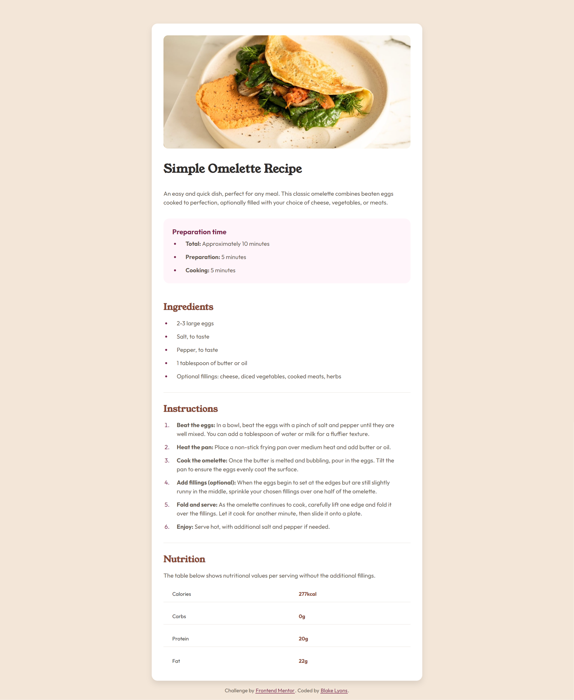

# Frontend Mentor - Recipe page solution

This is a solution to the [Recipe page challenge on Frontend Mentor](https://www.frontendmentor.io/challenges/recipe-page-KiTsR8QQKm). Frontend Mentor challenges help you improve your coding skills by building realistic projects. 

## Table of contents

- [Overview](#overview)
  - [The challenge](#the-challenge)
  - [Screenshot](#screenshot)
  - [Links](#links)
- [My process](#my-process)
  - [Built with](#built-with)
  - [Continued development](#continued-development)
- [Author](#author)

## Overview

### Screenshot

### Links

- Solution URL: [https://github.com/blakelyons/frontend-mentor-recipe-page-main](https://github.com/blakelyons/frontend-mentor-recipe-page-main)
- Live Site URL: [https://frontend-mentor-recipe-page-main.pages.dev/](https://frontend-mentor-recipe-page-main.pages.dev/)

## My process

### Built with

- Semantic HTML5 markup
- CSS custom properties
- Flexbox
- CSS Grid
- Mobile-first workflow
- [Sass](https://sass-lang.com/) - CSS Extension

### Continued development

I plan to use this recipe card to build a Vue App that is a catalog for recipes I use to cook meals.

## Author

- Website - [https://www.blakelyons.com](https://www.blakelyons.com)
- Frontend Mentor - [@blakelyons](https://www.frontendmentor.io/profile/blakelyons)
- Twitter - [@blakelyons](https://www.twitter.com/blakelyons)

